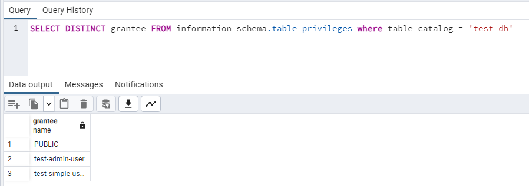
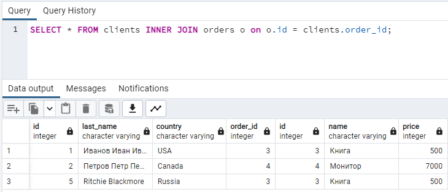

# Домашнее задание к занятию "6.2. SQL"

## Введение

Перед выполнением задания вы можете ознакомиться с 
[дополнительными материалами](https://github.com/netology-code/virt-homeworks/tree/master/additional/README.md).

## Задача 1

Используя docker поднимите инстанс PostgreSQL (версию 12) c 2 volume, 
в который будут складываться данные БД и бэкапы.

```
---
version: '3.6'

services: 
  postgres:
    container_name: postgres
    image: postgres:12-alpine
    env_file: ./.env
    environment:
      - POSTGRES_DB=${DB_NAME}
      - POSTGRES_USER=${DB_USER}
      - POSTGRES_PASSWORD=${DB_PASS}
    volumes: 
      - ./postgres:/var/lib/postgresql/data:Z
      - ./backup:/backup
    ports:
      - 5432:5432
```

## Задача 2

В БД из задачи 1: 
- создайте пользователя test-admin-user и БД test_db
- в БД test_db создайте таблицу orders и clients (спeцификация таблиц ниже)
- предоставьте привилегии на все операции пользователю test-admin-user на таблицы БД test_db
- создайте пользователя test-simple-user  
- предоставьте пользователю test-simple-user права на SELECT/INSERT/UPDATE/DELETE данных таблиц БД test_db

Таблица orders:
- id (serial primary key)
- наименование (string)
- цена (integer)

Таблица clients:
- id (serial primary key)
- фамилия (string)
- страна проживания (string, index)
- заказ (foreign key orders)

Приведите:
- итоговый список БД после выполнения пунктов выше,
- описание таблиц (describe)
- SQL-запрос для выдачи списка пользователей с правами над таблицами test_db
- список пользователей с правами над таблицами test_db

### Ответ
#### Создание таблицы orders
```
Create TABLE orders(
    id SERIAL,
    name VARCHAR, 
    price INTEGER,
    PRIMARY KEY (id)
);
```
#### Создание таблицы clients
```
CREATE TABLE clients (
    id SERIAL,
    last_name VARCHAR,
    country VARCHAR, 
    order_id INTEGER,
    PRIMARY KEY (id),
    CONSTRAINT fk_order
      FOREIGN KEY(order_id) 
	    REFERENCES orders(id)
);
```
#### Создание пользователя test-simple-user
```
CREATE USER "test-simple-user";
```
#### Даем права пользователю test-simple-user
```
GRANT CONNECT ON DATABASE test_db TO "test-simple-user";
GRANT USAGE ON SCHEMA public TO "test-simple-user";
GRANT SELECT, INSERT, UPDATE, DELETE ON orders, clients TO "test-simple-user";
```

#### Проверяем права пользователя test-simple-user к таблицам orders и clients
```
SELECT * FROM information_schema.role_table_grants WHERE table_name IN ('orders', 'clients') and grantee = 'test-simple-user';
```


#### Список пользователей с правами над таблицами test_db



## Задача 3

Используя SQL синтаксис - наполните таблицы следующими тестовыми данными:

Таблица orders

|Наименование|цена|
|------------|----|
|Шоколад| 10 |
|Принтер| 3000 |
|Книга| 500 |
|Монитор| 7000|
|Гитара| 4000|

Таблица clients

|ФИО|Страна проживания|
|------------|----|
|Иванов Иван Иванович| USA |
|Петров Петр Петрович| Canada |
|Иоганн Себастьян Бах| Japan |
|Ронни Джеймс Дио| Russia|
|Ritchie Blackmore| Russia|

Используя SQL синтаксис:
- вычислите количество записей для каждой таблицы 
- приведите в ответе:
    - запросы 
    - результаты их выполнения.

### Ответ

```
INSERT INTO orders (name, price) VALUES
('Шоколад', 10),
('Принтер', 3000),
('Книга', 500),
('Монитор', 7000),
('Гитара', 4000);
```

```
SELECT COUNT(*) FROM orders;
```

```
INSERT INTO clients (last_name, country) VALUES
    ('Иванов Иван Иванович', 'USA'),
    ('Петров Петр Петрович', 'Canada'),
    ('Иоганн Себастьян Бах', 'Japan'),
    ('Ронни Джеймс Дио', 'Russia'),
    ('Ritchie Blackmore', 'Russia');
```

```
SELECT COUNT(*) FROM clients;
```

## Задача 4

Часть пользователей из таблицы clients решили оформить заказы из таблицы orders.

Используя foreign keys свяжите записи из таблиц, согласно таблице:

|ФИО|Заказ|
|------------|----|
|Иванов Иван Иванович| Книга |
|Петров Петр Петрович| Монитор |
|Иоганн Себастьян Бах| Гитара |

Приведите SQL-запросы для выполнения данных операций.

Приведите SQL-запрос для выдачи всех пользователей, которые совершили заказ, а также вывод данного запроса.
 
### Ответ

```
UPDATE clients SET order_id = 3 WHERE id = 1;
UPDATE clients SET order_id = 4 WHERE id = 2;
UPDATE clients SET order_id = 3 WHERE id = 5;
```

```
SELECT * FROM clients INNER JOIN orders o on o.id = clients.order_id;
```



## Задача 5

Получите полную информацию по выполнению запроса выдачи всех пользователей из задачи 4 
(используя директиву EXPLAIN).

### Ответ

```
"QUERY PLAN"
"Seq Scan on clients  (cost=0.00..1.05 rows=3 width=47)"
"  Filter: (""Order"" IS NOT NULL)"
```
### Cost - оценочная стоимость.

### Rows - число записей, обработанных для получения выходных данных.

### Width - среднее количество байт в одной строке.

## Задача 6

Создайте бэкап БД test_db и поместите его в volume, предназначенный для бэкапов (см. Задачу 1).

Остановите контейнер с PostgreSQL (но не удаляйте volumes).

Поднимите новый пустой контейнер с PostgreSQL.

Восстановите БД test_db в новом контейнере.

Приведите список операций, который вы применяли для бэкапа данных и восстановления. 

```
06-db-02-sql> docker exec -it postgres /bin/bash 
bash-5.1# cd backup/
bash-5.1# pg_dumpall -U test-admin-user --roles-only -f roles.sql
bash-5.1# pg_dump -U test-admin-user test_db > test_db.sql
bash-5.1# exit
06-db-02-sql> docker-compose down
```
### Удаляем данные из папки postgres, запускаем контейнер и восстанавливаем базу

```
06-db-02-sql> docker-compose up -d
06-db-02-sql> docker exec -it postgres /bin/bash
bash-5.1# cd backup/
bash-5.1# psql -U test-admin-user -f roles.sql
bash-5.1# psql -U test-admin-user test_db < test_db.sql
```