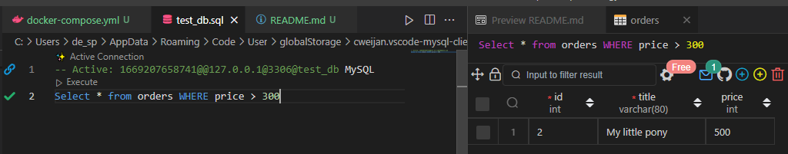

# Домашнее задание к занятию "6.3. MySQL"

## Введение

Перед выполнением задания вы можете ознакомиться с 
[дополнительными материалами](https://github.com/netology-code/virt-homeworks/tree/master/additional/README.md).

## Задача 1

Используя docker поднимите инстанс MySQL (версию 8). Данные БД сохраните в volume.

Изучите [бэкап БД](https://github.com/netology-code/virt-homeworks/tree/master/06-db-03-mysql/test_data) и 
восстановитесь из него.

Перейдите в управляющую консоль `mysql` внутри контейнера.

Используя команду `\h` получите список управляющих команд.

Найдите команду для выдачи статуса БД и **приведите в ответе** из ее вывода версию сервера БД.

Подключитесь к восстановленной БД и получите список таблиц из этой БД.

**Приведите в ответе** количество записей с `price` > 300.

В следующих заданиях мы будем продолжать работу с данным контейнером.

### Ответ

1. Используя docker поднимите инстанс MySQL (версию 8). Данные БД сохраните в volume. Подключаюсь к контейнеру 
```
C:\Programming\DevOps\devops-netology\homeworks\06-db-03-mysql> docker-compose up -d
PS C:\Programming\DevOps\devops-netology\homeworks\06-db-03-mysql> docker ps 
CONTAINER ID   IMAGE     COMMAND                  CREATED         STATUS         PORTS                               NAMES
21d658162da1   mysql:8   "docker-entrypoint.s…"   4 minutes ago   Up 4 minutes   0.0.0.0:3306->3306/tcp, 33060/tcp   mysql
PS C:\Programming\DevOps\devops-netology\homeworks\06-db-03-mysql> docker exec -it mysql /bin/bash
```
### Подключение к mysql
```
bash-4.4# mysql -u root -p
```
### Статус БД
```
mysql> \s
--------------
mysql  Ver 8.0.31 for Linux on x86_64 (MySQL Community Server - GPL)

Connection id:          10
Current database:
Current user:           root@localhost
SSL:                    Not in use
Current pager:          stdout
Using outfile:          ''
Using delimiter:        ;
Server version:         8.0.31 MySQL Community Server - GPL
Protocol version:       10
Connection:             Localhost via UNIX socket
Server characterset:    utf8mb4
Db     characterset:    utf8mb4
Client characterset:    latin1
Conn.  characterset:    latin1
UNIX socket:            /var/run/mysqld/mysqld.sock
Binary data as:         Hexadecimal
Uptime:                 6 min 38 sec

Threads: 2  Questions: 5  Slow queries: 0  Opens: 119  Flush tables: 3  Open tables: 38  Queries per second avg: 0.012
```

### Разворачиваем бэкап
### bash-4.4# mysql -u root -p test_db < test_dump.sql

### Количество записей с `price` > 300.

<p align="center">
  
</p>

## Задача 2

Создайте пользователя test в БД c паролем test-pass, используя:
- плагин авторизации mysql_native_password
- срок истечения пароля - 180 дней 
- количество попыток авторизации - 3 
- максимальное количество запросов в час - 100
- аттрибуты пользователя:
    - Фамилия "Pretty"
    - Имя "James"

Предоставьте привелегии пользователю `test` на операции SELECT базы `test_db`.
    
Используя таблицу INFORMATION_SCHEMA.USER_ATTRIBUTES получите данные по пользователю `test` и 
**приведите в ответе к задаче**.

### Ответ

```
CREATE USER 'test'@'localhost'
    IDENTIFIED WITH caching_sha2_password BY 'test-pass'
    REQUIRE NONE
 WITH MAX_QUERIES_PER_HOUR 100
PASSWORD EXPIRE INTERVAL 180 DAY FAILED_LOGIN_ATTEMPTS 3 PASSWORD_LOCK_TIME 2
ATTRIBUTE '{"fname": "Pretty", "lname": "James"}';

GRANT SELECT ON test_db.* TO 'test'@'localhost';

SELECT * FROM INFORMATION_SCHEMA.USER_ATTRIBUTES WHERE USER = "test";
```

## Задача 3

Установите профилирование `SET profiling = 1`.
Изучите вывод профилирования команд `SHOW PROFILES;`.

Исследуйте, какой `engine` используется в таблице БД `test_db` и **приведите в ответе**.

Измените `engine` и **приведите время выполнения и запрос на изменения из профайлера в ответе**:
- на `MyISAM`
- на `InnoDB`

```
mysql> show tables
    -> ;
+-------------------+
| Tables_in_test_db |
+-------------------+
| orders            |
+-------------------+

mysql> select TABLE_NAME,
    -> ENGINE
    -> From information_schema.TABLES
    -> Where TABLE_SCHEMA = 'test_db';
+------------+--------+
| TABLE_NAME | ENGINE |
+------------+--------+
| orders     | InnoDB |
+------------+--------+
1 row in set (0.01 sec)

mysql> set profiling = 1 ;
Query OK, 0 rows affected, 1 warning (0.00 sec)

mysql> alter table orders ENGINE = MyISAM;
Query OK, 5 rows affected (0.10 sec)
Records: 5  Duplicates: 0  Warnings: 0

mysql> show profiles;
+----------+------------+------------------------------------+
| Query_ID | Duration   | Query                              |
+----------+------------+------------------------------------+
|        1 | 0.00006900 | alter table order ENGINE = MyISAM  |
|        2 | 0.09708675 | alter table orders ENGINE = MyISAM |
+----------+------------+------------------------------------+
2 rows in set, 1 warning (0.00 sec)

mysql> show profile for query 2;
+--------------------------------+----------+
| Status                         | Duration |
+--------------------------------+----------+
| starting                       | 0.000052 |
| Executing hook on transaction  | 0.000037 |
| starting                       | 0.000018 |
| checking permissions           | 0.000004 |
| checking permissions           | 0.000004 |
| init                           | 0.000022 |
| Opening tables                 | 0.000427 |
| setup                          | 0.000291 |
| creating table                 | 0.004299 |
| waiting for handler commit     | 0.000018 |
| waiting for handler commit     | 0.002869 |
| After create                   | 0.018303 |
| System lock                    | 0.000014 |
| copy to tmp table              | 0.001785 |
| waiting for handler commit     | 0.000065 |
| waiting for handler commit     | 0.000013 |
| waiting for handler commit     | 0.001766 |
| rename result table            | 0.000132 |
| waiting for handler commit     | 0.020748 |
| waiting for handler commit     | 0.000012 |
| waiting for handler commit     | 0.020224 |
| waiting for handler commit     | 0.000016 |
| waiting for handler commit     | 0.008270 |
| waiting for handler commit     | 0.000013 |
| waiting for handler commit     | 0.002691 |
| end                            | 0.013299 |
| query end                      | 0.001578 |
| closing tables                 | 0.000010 |
| waiting for handler commit     | 0.000015 |
| freeing items                  | 0.000033 |
| cleaning up                    | 0.000062 |
+--------------------------------+----------+
31 rows in set, 1 warning (0.00 sec)
```

## Задача 4 

Изучите файл `my.cnf` в директории /etc/mysql.

Измените его согласно ТЗ (движок InnoDB):
- Скорость IO важнее сохранности данных
- Нужна компрессия таблиц для экономии места на диске
- Размер буффера с незакомиченными транзакциями 1 Мб
- Буффер кеширования 30% от ОЗУ
- Размер файла логов операций 100 Мб

Приведите в ответе измененный файл `my.cnf`.

### Ответ
В docker-compose подключен volume /etc/mysql/conf.d, в который складываются пользовательские конфигурации для расширения

```
[mysqld]

pid-file        = /var/run/mysqld/mysqld.pid
socket          = /var/run/mysqld/mysqld.sock
datadir         = /var/lib/mysql
secure-file-priv= NULL

innodb_flush_log_at_trx_commit = 2
innodb_buffer_pool_size = 582M
innodb_log_buffer_size = 1M
innodb_log_file_size = 100M
```

---