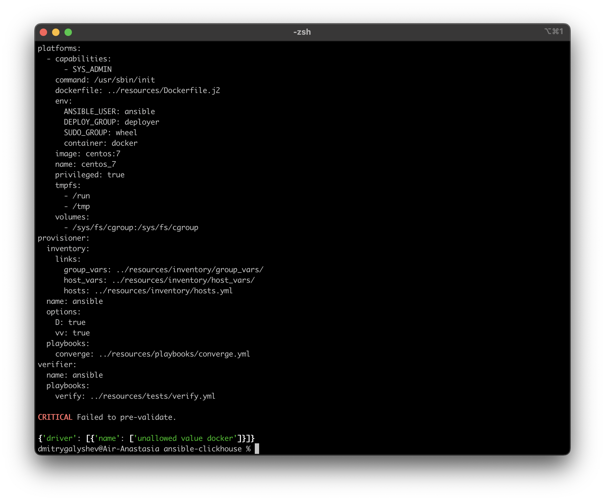
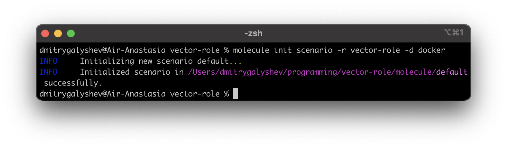

# Домашнее задание к занятию 5 «Тестирование roles»

## Подготовка к выполнению

1. Установите molecule: `pip3 install "molecule==3.5.2"`.
2. Выполните `docker pull aragast/netology:latest` —  это образ с podman, tox и несколькими пайтонами (3.7 и 3.9) внутри.

## Основная часть

Ваша цель — настроить тестирование ваших ролей. 

Задача — сделать сценарии тестирования для vector. 

Ожидаемый результат — все сценарии успешно проходят тестирование ролей.

### Molecule

1. Запустите  `molecule test -s centos_7` внутри корневой директории clickhouse-role, посмотрите на вывод команды. Данная команда может отработать с ошибками, это нормально. Наша цель - посмотреть как другие в реальном мире используют молекулу.
2. Перейдите в каталог с ролью vector-role и создайте сценарий тестирования по умолчанию при помощи `molecule init scenario --driver-name docker`.
3. Добавьте несколько разных дистрибутивов (centos:8, ubuntu:latest) для инстансов и протестируйте роль, исправьте найденные ошибки, если они есть.
4. Добавьте несколько assert в verify.yml-файл для  проверки работоспособности vector-role (проверка, что конфиг валидный, проверка успешности запуска и др.). 
5. Запустите тестирование роли повторно и проверьте, что оно прошло успешно.
5. Добавьте новый тег на коммит с рабочим сценарием в соответствии с семантическим версионированием.

### Ответ




### [Vector-role v1.1.0](https://github.com/Frozzz54/vector-role/releases/tag/1.1.0)

### Tox

1. Добавьте в директорию с vector-role файлы из [директории](./example).
2. Запустите `docker run --privileged=True -v <path_to_repo>:/opt/vector-role -w /opt/vector-role -it aragast/netology:latest /bin/bash`, где path_to_repo — путь до корня репозитория с vector-role на вашей файловой системе.
3. Внутри контейнера выполните команду `tox`, посмотрите на вывод.
5. Создайте облегчённый сценарий для `molecule` с драйвером `molecule_podman`. Проверьте его на исполнимость.
6. Пропишите правильную команду в `tox.ini`, чтобы запускался облегчённый сценарий.
8. Запустите команду `tox`. Убедитесь, что всё отработало успешно.
9. Добавьте новый тег на коммит с рабочим сценарием в соответствии с семантическим версионированием.

### Ответ 
3. Внутри контейнера выполните команду `tox`, посмотрите на вывод.
```
[root@6e646332d1db vector-role]# tox
py37-ansible210 create: /opt/vector-role/.tox/py37-ansible210
py37-ansible210 installdeps: -rtox-requirements.txt, ansible<3.0
py37-ansible210 installed: ansible==2.10.7,ansible-base==2.10.17,ansible-compat==1.0.0,ansible-lint==5.1.3,arrow==1.2.3,bcrypt==4.0.1,binaryornot==0.4.4,bracex==2.3.post1,cached-property==1.5.2,Cerberus==1.3.2,certifi==2023.5.7,cffi==1.15.1,chardet==5.1.0,charset-normalizer==3.1.0,click==8.1.3,click-help-colors==0.9.1,cookiecutter==2.1.1,cryptography==40.0.2,distro==1.8.0,enrich==1.2.7,idna==3.4,importlib-metadata==6.6.0,Jinja2==3.1.2,jinja2-time==0.2.0,jmespath==1.0.1,lxml==4.9.2,markdown-it-py==2.2.0,MarkupSafe==2.1.2,mdurl==0.1.2,molecule==3.4.0,molecule-podman==1.0.1,packaging==23.1,paramiko==2.12.0,pathspec==0.11.1,pluggy==0.13.1,pycparser==2.21,Pygments==2.15.1,PyNaCl==1.5.0,python-dateutil==2.8.2,python-slugify==8.0.1,PyYAML==5.4.1,requests==2.31.0,rich==13.3.5,ruamel.yaml==0.17.28,ruamel.yaml.clib==0.2.7,selinux==0.2.1,six==1.16.0,subprocess-tee==0.3.5,tenacity==8.2.2,text-unidecode==1.3,typing_extensions==4.6.2,urllib3==2.0.2,wcmatch==8.4.1,yamllint==1.26.3,zipp==3.15.0
py37-ansible210 run-test-pre: PYTHONHASHSEED='731506093'
py37-ansible210 run-test: commands[0] | molecule test -s compatibility --destroy always
CRITICAL 'molecule/compatibility/molecule.yml' glob failed.  Exiting.
ERROR: InvocationError for command /opt/vector-role/.tox/py37-ansible210/bin/molecule test -s compatibility --destroy always (exited with code 1)
py37-ansible30 create: /opt/vector-role/.tox/py37-ansible30
py37-ansible30 installdeps: -rtox-requirements.txt, ansible<3.1
py37-ansible30 installed: ansible==3.0.0,ansible-base==2.10.17,ansible-compat==1.0.0,ansible-lint==5.1.3,arrow==1.2.3,bcrypt==4.0.1,binaryornot==0.4.4,bracex==2.3.post1,cached-property==1.5.2,Cerberus==1.3.2,certifi==2023.5.7,cffi==1.15.1,chardet==5.1.0,charset-normalizer==3.1.0,click==8.1.3,click-help-colors==0.9.1,cookiecutter==2.1.1,cryptography==40.0.2,distro==1.8.0,enrich==1.2.7,idna==3.4,importlib-metadata==6.6.0,Jinja2==3.1.2,jinja2-time==0.2.0,jmespath==1.0.1,lxml==4.9.2,markdown-it-py==2.2.0,MarkupSafe==2.1.2,mdurl==0.1.2,molecule==3.4.0,molecule-podman==1.0.1,packaging==23.1,paramiko==2.12.0,pathspec==0.11.1,pluggy==0.13.1,pycparser==2.21,Pygments==2.15.1,PyNaCl==1.5.0,python-dateutil==2.8.2,python-slugify==8.0.1,PyYAML==5.4.1,requests==2.31.0,rich==13.3.5,ruamel.yaml==0.17.28,ruamel.yaml.clib==0.2.7,selinux==0.2.1,six==1.16.0,subprocess-tee==0.3.5,tenacity==8.2.2,text-unidecode==1.3,typing_extensions==4.6.2,urllib3==2.0.2,wcmatch==8.4.1,yamllint==1.26.3,zipp==3.15.0
py37-ansible30 run-test-pre: PYTHONHASHSEED='731506093'
py37-ansible30 run-test: commands[0] | molecule test -s compatibility --destroy always
CRITICAL 'molecule/compatibility/molecule.yml' glob failed.  Exiting.
ERROR: InvocationError for command /opt/vector-role/.tox/py37-ansible30/bin/molecule test -s compatibility --destroy always (exited with code 1)
py39-ansible210 create: /opt/vector-role/.tox/py39-ansible210
py39-ansible210 installdeps: -rtox-requirements.txt, ansible<3.0
py39-ansible210 installed: ansible==2.10.7,ansible-base==2.10.17,ansible-compat==4.1.0,ansible-core==2.15.0,ansible-lint==5.1.3,arrow==1.2.3,attrs==23.1.0,bcrypt==4.0.1,binaryornot==0.4.4,bracex==2.3.post1,Cerberus==1.3.2,certifi==2023.5.7,cffi==1.15.1,chardet==5.1.0,charset-normalizer==3.1.0,click==8.1.3,click-help-colors==0.9.1,cookiecutter==2.1.1,cryptography==40.0.2,distro==1.8.0,enrich==1.2.7,idna==3.4,importlib-resources==5.0.7,Jinja2==3.1.2,jinja2-time==0.2.0,jmespath==1.0.1,jsonschema==4.17.3,lxml==4.9.2,markdown-it-py==2.2.0,MarkupSafe==2.1.2,mdurl==0.1.2,molecule==3.4.0,molecule-podman==1.0.1,packaging==23.1,paramiko==2.12.0,pathspec==0.11.1,pluggy==0.13.1,pycparser==2.21,Pygments==2.15.1,PyNaCl==1.5.0,pyrsistent==0.19.3,python-dateutil==2.8.2,python-slugify==8.0.1,PyYAML==5.4.1,requests==2.31.0,resolvelib==1.0.1,rich==13.3.5,ruamel.yaml==0.17.28,ruamel.yaml.clib==0.2.7,selinux==0.3.0,six==1.16.0,subprocess-tee==0.4.1,tenacity==8.2.2,text-unidecode==1.3,typing_extensions==4.6.2,urllib3==2.0.2,wcmatch==8.4.1,yamllint==1.26.3
py39-ansible210 run-test-pre: PYTHONHASHSEED='731506093'
py39-ansible210 run-test: commands[0] | molecule test -s compatibility --destroy always
CRITICAL 'molecule/compatibility/molecule.yml' glob failed.  Exiting.
ERROR: InvocationError for command /opt/vector-role/.tox/py39-ansible210/bin/molecule test -s compatibility --destroy always (exited with code 1)
py39-ansible30 create: /opt/vector-role/.tox/py39-ansible30
py39-ansible30 installdeps: -rtox-requirements.txt, ansible<3.1
py39-ansible30 installed: ansible==3.0.0,ansible-base==2.10.17,ansible-compat==4.1.0,ansible-core==2.15.0,ansible-lint==5.1.3,arrow==1.2.3,attrs==23.1.0,bcrypt==4.0.1,binaryornot==0.4.4,bracex==2.3.post1,Cerberus==1.3.2,certifi==2023.5.7,cffi==1.15.1,chardet==5.1.0,charset-normalizer==3.1.0,click==8.1.3,click-help-colors==0.9.1,cookiecutter==2.1.1,cryptography==40.0.2,distro==1.8.0,enrich==1.2.7,idna==3.4,importlib-resources==5.0.7,Jinja2==3.1.2,jinja2-time==0.2.0,jmespath==1.0.1,jsonschema==4.17.3,lxml==4.9.2,markdown-it-py==2.2.0,MarkupSafe==2.1.2,mdurl==0.1.2,molecule==3.4.0,molecule-podman==1.0.1,packaging==23.1,paramiko==2.12.0,pathspec==0.11.1,pluggy==0.13.1,pycparser==2.21,Pygments==2.15.1,PyNaCl==1.5.0,pyrsistent==0.19.3,python-dateutil==2.8.2,python-slugify==8.0.1,PyYAML==5.4.1,requests==2.31.0,resolvelib==1.0.1,rich==13.3.5,ruamel.yaml==0.17.28,ruamel.yaml.clib==0.2.7,selinux==0.3.0,six==1.16.0,subprocess-tee==0.4.1,tenacity==8.2.2,text-unidecode==1.3,typing_extensions==4.6.2,urllib3==2.0.2,wcmatch==8.4.1,yamllint==1.26.3
py39-ansible30 run-test-pre: PYTHONHASHSEED='731506093'
py39-ansible30 run-test: commands[0] | molecule test -s compatibility --destroy always
CRITICAL 'molecule/compatibility/molecule.yml' glob failed.  Exiting.
ERROR: InvocationError for command /opt/vector-role/.tox/py39-ansible30/bin/molecule test -s compatibility --destroy always (exited with code 1)
_________________________________________________________________________________________________________________________________________ summary _________________________________________________________________________________________________________________________________________ERROR:   py37-ansible210: commands failed
ERROR:   py37-ansible30: commands failed
ERROR:   py39-ansible210: commands failed
ERROR:   py39-ansible30: commands failed
```

```
[root@6e646332d1db vector-role]# ansible --version
ansible 2.10.17
  config file = None
  configured module search path = ['/root/.ansible/plugins/modules', '/usr/share/ansible/plugins/modules']
  ansible python module location = /opt/vector-role/.tox/py37-ansible30/lib/python3.7/site-packages/ansible
  executable location = /opt/vector-role/.tox/py37-ansible30/bin/ansible
  python version = 3.7.10 (default, Jun 13 2022, 19:37:24) [GCC 8.5.0 20210514 (Red Hat 8.5.0-10)]
```

```
[root@6e646332d1db vector-role]# molecule --version
molecule 3.4.0 using python 3.7 
    ansible:2.10.17
    delegated:3.4.0 from molecule
    podman:1.0.1 from molecule_podman requiring collections: containers.podman>=1.7.0 ansible.posix>=1.3.0
```

### При запуске команды 
```
molecule test -s podman
```
### Получаю следующее сообщение
```
failed: [localhost] (item=centos:centos7) => {"ansible_loop_var": "item", "attempts": 3, "changed": true, "cmd": ["/usr/bin/podman", "build", "-f", "/root/.cache/molecule/vector-role/podman/Dockerfile_centos_centos7", "-t", "molecule_local/centos:centos7"], "delta": "0:00:00.979293", "end": "2023-05-28 06:44:14.693161", "item": {"ansible_index_var": "i", "ansible_loop_var": "item", "changed": true, "checksum": "3c417b221c03aad9966fa2d8ba73f2942d898b7a", "dest": "/root/.cache/molecule/vector-role/podman/Dockerfile_centos_centos7", "diff": [], "failed": false, "gid": 0, "group": "root", "i": 0, "invocation": {"module_args": {"_original_basename": "Dockerfile.j2", "attributes": null, "backup": false, "checksum": "3c417b221c03aad9966fa2d8ba73f2942d898b7a", "content": null, "dest": "/root/.cache/molecule/vector-role/podman/Dockerfile_centos_centos7", "directory_mode": null, "follow": false, "force": true, "group": null, "local_follow": null, "mode": "0600", "owner": null, "remote_src": null, "selevel": null, "serole": null, "setype": null, "seuser": null, "src": "/root/.ansible/tmp/ansible-tmp-1685256152.6818612-3801-172200933907501/source", "unsafe_writes": false, "validate": null}}, "item": {"capabilities": ["SYS_ADMIN"], "command": "/usr/sbin/init", "env": {"ANSIBLE_USER": "ansible", "DEPLOY_GROUP": "deployer", "SUDO_GROUP": "wheel", "container": "podman"}, "image": "centos:centos7", "name": "centos_7", "privileged": true, "tmpfs": ["/run", "/tmp"], "volumes": ["/sys/fs/cgroup:/sys/fs/cgroup"]}, "md5sum": "65eff659ba21e513870b4cfca7f156ec", "mode": "0600", "owner": "root", "size": 1504, "src": "/root/.ansible/tmp/ansible-tmp-1685256152.6818612-3801-172200933907501/source", "state": "file", "uid": 0}, "msg": "non-zero return code", "rc": 125, "start": "2023-05-28 06:44:13.713868", "stderr": "time=\"2023-05-28T06:44:14Z\" level=warning msg=\"Failed to load cached network config: network podman not found in CNI cache, falling back to loading network podman from disk\"\ntime=\"2023-05-28T06:44:14Z\" level=warning msg=\"1 error occurred:\\n\\t* plugin type=\\\"bridge\\\" failed (delete): cni plugin bridge failed: running [/usr/sbin/iptables -t nat -D POSTROUTING -s 10.88.0.19 -j CNI-9a7c92e838e9a22b9891a275 -m comment --comment name: \\\"podman\\\" id: \\\"buildah-buildah3762794591\\\" --wait]: exit status 2: iptables v1.8.4 (nf_tables): Couldn't load match `comment':No such file or directory\\n\\nTry `iptables -h' or 'iptables --help' for more information.\\n\\n\\n\"\nerror running container: did not get container start message from parent: EOF\nError: error building at STEP \"RUN if [ $(command -v apt-get) ]; then apt-get update && apt-get upgrade -y && apt-get install -y apt-transport-https gnupg2 python3-minimal python3-apt man systemd systemd-sysv rsyslog sudo bash ca-certificates 
iproute2 && apt-get clean;     elif [ $(command -v yum) ]; then sed -i 's/^\\(tsflags=*\\)/# \\1/g' /etc/yum.conf && yum makecache fast && yum upgrade -y && yum makecache fast && yum install -y sudo python3 systemd rsyslog man yum-plugin-ovl bash iproute && sed -i 's/plugins=0/plugins=1/g' /etc/yum.conf && yum clean all; fi\": plugin type=\"bridge\" failed (add): cni plugin bridge failed: failed to list chains: running [/usr/sbin/iptables -t nat -S --wait]: exit status 4: iptables v1.8.4 (nf_tables):  CHAIN_ADD failed (No such file or directory): chain PREROUTING", "stderr_lines": ["time=\"2023-05-28T06:44:14Z\" level=warning msg=\"Failed to load cached network config: network podman not found in CNI cache, falling back to loading network podman from disk\"", "time=\"2023-05-28T06:44:14Z\" level=warning msg=\"1 error occurred:\\n\\t* plugin type=\\\"bridge\\\" failed (delete): cni plugin bridge failed: running [/usr/sbin/iptables -t nat -D POSTROUTING -s 10.88.0.19 -j CNI-9a7c92e838e9a22b9891a275 -m comment --comment name: \\\"podman\\\" id: \\\"buildah-buildah3762794591\\\" --wait]: exit status 2: iptables v1.8.4 
(nf_tables): Couldn't load match `comment':No such file or directory\\n\\nTry `iptables -h' or 'iptables --help' for more information.\\n\\n\\n\"", "error running container: did not get container start message from parent: EOF", "Error: error building at STEP \"RUN if [ $(command -v apt-get) ]; then apt-get update && apt-get upgrade -y && apt-get install -y apt-transport-https gnupg2 python3-minimal python3-apt man systemd systemd-sysv rsyslog sudo bash ca-certificates iproute2 && apt-get clean;     elif [ $(command -v yum) ]; then sed -i 's/^\\(tsflags=*\\)/# \\1/g' /etc/yum.conf && yum makecache fast && yum upgrade -y && yum makecache fast && yum install -y sudo python3 systemd rsyslog man yum-plugin-ovl bash iproute && sed -i 's/plugins=0/plugins=1/g' /etc/yum.conf && yum clean all; fi\": plugin type=\"bridge\" failed (add): cni plugin bridge failed: failed to list chains: running [/usr/sbin/iptables -t nat -S --wait]: exit status 4: iptables v1.8.4 (nf_tables):  CHAIN_ADD failed (No such file or directory): chain PREROUTING"], "stdout": "STEP 1/10: FROM centos:centos7\nSTEP 2/10: ENV ANSIBLE_USER ansible\n--> Using cache 4b275a4bdc4e642da40375f7f659a6043c1989f09eff3a0559b2806b5713ee95\n--> 4b275a4bdc4\nSTEP 3/10: ENV DEPLOY_GROUP deployer\n--> Using cache e5f9e7162526548aadbc3f003792c3414ecb79f7721446740e373fa5e6ed92d8\n--> e5f9e716252\nSTEP 4/10: ENV SUDO_GROUP wheel\n--> Using cache 9489225c13f233e8c59c04483c8d41241d2b72a072dff6686ace893fbc570886\n--> 9489225c13f\nSTEP 5/10: ENV container podman\n--> Using cache c2c2f3653b9bcaebebb2bb1d7e82517068d673b256fec94bb5b31c27ca4e1545\n--> c2c2f3653b9\nSTEP 6/10: RUN if [ $(command -v apt-get) ]; then apt-get update && apt-get upgrade -y && apt-get install -y apt-transport-https gnupg2 python3-minimal python3-apt man systemd systemd-sysv rsyslog sudo bash ca-certificates iproute2 && apt-get clean;     elif [ $(command -v yum) ]; then sed -i 's/^\\(tsflags=*\\)/# \\1/g' /etc/yum.conf && yum makecache 
fast && yum upgrade -y && yum makecache fast && yum install -y sudo python3 systemd rsyslog man yum-plugin-ovl bash iproute && sed -i 's/plugins=0/plugins=1/g' /etc/yum.conf && yum clean all; fi", "stdout_lines": ["STEP 1/10: FROM centos:centos7", "STEP 2/10: ENV ANSIBLE_USER ansible", "--> Using cache 4b275a4bdc4e642da40375f7f659a6043c1989f09eff3a0559b2806b5713ee95", "--> 4b275a4bdc4", "STEP 3/10: ENV DEPLOY_GROUP deployer", "--> Using cache e5f9e7162526548aadbc3f003792c3414ecb79f7721446740e373fa5e6ed92d8", "--> e5f9e716252", "STEP 4/10: ENV SUDO_GROUP wheel", "--> Using cache 9489225c13f233e8c59c04483c8d41241d2b72a072dff6686ace893fbc570886", "--> 9489225c13f", "STEP 5/10: ENV container podman", "--> Using cache c2c2f3653b9bcaebebb2bb1d7e82517068d673b256fec94bb5b31c27ca4e1545", "--> c2c2f3653b9", "STEP 6/10: RUN if [ $(command -v apt-get) ]; then apt-get update && apt-get upgrade -y && apt-get install -y apt-transport-https gnupg2 python3-minimal python3-apt man systemd systemd-sysv rsyslog sudo bash ca-certificates iproute2 && apt-get clean;     elif [ $(command -v yum) ]; then sed -i 's/^\\(tsflags=*\\)/# \\1/g' /etc/yum.conf && yum makecache fast && yum upgrade -y && yum makecache fast && yum install -y sudo python3 systemd rsyslog man yum-plugin-ovl bash iproute && sed -i 's/plugins=0/plugins=1/g' /etc/yum.conf && yum clean all; fi"]}
```

6. Пропишите правильную команду в `tox.ini`, чтобы запускался облегчённый сценарий.
7. Запустите команду `tox`. Убедитесь, что всё отработало успешно.

```
commands =
    {posargs:molecule test -s podman}
```
### Новый тэг [Vector-role v1.2.0](https://github.com/Frozzz54/vector-role/releases/tag/1.2.0)