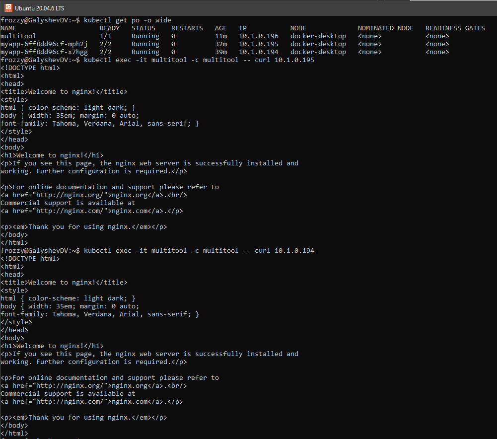

# Домашнее задание к занятию «Запуск приложений в K8S»

### Цель задания

В тестовой среде для работы с Kubernetes, установленной в предыдущем ДЗ, необходимо развернуть Deployment с приложением, состоящим из нескольких контейнеров, и масштабировать его.

------

### Чеклист готовности к домашнему заданию

1. Установленное k8s-решение (например, MicroK8S).
2. Установленный локальный kubectl.
3. Редактор YAML-файлов с подключённым git-репозиторием.

------

### Инструменты и дополнительные материалы, которые пригодятся для выполнения задания

1. [Описание](https://kubernetes.io/docs/concepts/workloads/controllers/deployment/) Deployment и примеры манифестов.
2. [Описание](https://kubernetes.io/docs/concepts/workloads/pods/init-containers/) Init-контейнеров.
3. [Описание](https://github.com/wbitt/Network-MultiTool) Multitool.

------

### Задание 1. Создать Deployment и обеспечить доступ к репликам приложения из другого Pod

1. Создать Deployment приложения, состоящего из двух контейнеров — nginx и multitool. Решить возникшую ошибку.
2. После запуска увеличить количество реплик работающего приложения до 2.
3. Продемонстрировать количество подов до и после масштабирования.

### Ответ

Код манифеста
```yml
apiVersion: apps/v1
kind: Deployment
metadata:
  name: myapp
spec:
  replicas: 1
  selector:
    matchLabels:
      app: myapp
  template:
    metadata:
      labels: 
        app: myapp
    spec:
      containers: 
      - name: nginx
        image: nginx
        ports:
        - containerPort: 80
      - name: multitool
        image: wbitt/network-multitool:latest
        env:
        - name: HTTP_PORT
          value: "1180"
        - name: HTTPS_PORT
          value: "11443"
        ports:
        - containerPort: 1180
          name: http-port
        - containerPort: 11443
          name: https-port
```
kubectl apply -f .\deployment-app.yml
```
frozzy@GalyshevDV:~$ kubectl get po
NAME                     READY   STATUS    RESTARTS   AGE
myapp-6ff8dd96cf-x7hgg   2/2     Running   0          103s
```

### Увеличено количество реплик на 2

```yml
spec:
  replicas: 2
```

kubectl apply -f .\deployment-app.yml

```
frozzy@GalyshevDV:~$ kubectl get po
NAME                     READY   STATUS    RESTARTS   AGE
myapp-6ff8dd96cf-mph2j   2/2     Running   0          54s
myapp-6ff8dd96cf-x7hgg   2/2     Running   0          7m41s
```

### 4. Создать Service, который обеспечит доступ до реплик приложений из п.1.

```yml
apiVersion: v1
kind: Service
metadata:
  name: myapp-service
spec:
  selector:
    app: myapp
  ports:
  - name: nginx-port
    port: 80
    targetPort: 80
  - name: multitool-port
    port: 1180
    targetPort: 1180
  type: LoadBalancer
```

### 5. Создать отдельный Pod с приложением multitool и убедиться с помощью `curl`, что из пода есть доступ до приложений из п.1.

```yml
apiVersion: v1
kind: Pod
metadata:
  name: multitool
  labels:
    app: multitool 
spec:
  containers:
  - name: multitool
    image: wbitt/network-multitool:latest
    env:
    - name: HTTP_PORT
      value: "1180"
    - name: HTTPS_PORT
      value: "11443"
    ports:
    - containerPort: 1180
      name: http-port
    - containerPort: 11443
      name: https-port
```



### Проверка доступа по имени сервиса


------

### Задание 2. Создать Deployment и обеспечить старт основного контейнера при выполнении условий

### 1. Создать [Deployment](./deployment-app2.yml) приложения nginx и обеспечить старт контейнера только после того, как будет запущен сервис этого приложения.

```yml
apiVersion: apps/v1
kind: Deployment
metadata:
  name: myapp2
spec:
  replicas: 1
  selector:
    matchLabels:
      app: myapp2
  template:
    metadata:
      labels:
        app: myapp2
    spec:
      initContainers:
      - name: busybox-init
        image: busybox
        command: ['sh', '-c', "until nslookup nginx-service.default.svc.cluster.local >/dev/null 2>&1; do echo waiting for service; sleep 1; done;"]
      containers:
      - name: nginx
        image: nginx
        ports:
        - containerPort: 80
```

2. Убедиться, что nginx не стартует. В качестве Init-контейнера взять busybox.

```
frozzy@GalyshevDV:~$ kubectl get deployments
NAME     READY   UP-TO-DATE   AVAILABLE   AGE
myapp    2/2     2            2           111m
myapp2   0/1     1            0           55s
```

3. Создать и запустить Service. Убедиться, что Init запустился.

```yml
apiVersion: v1
kind: Service
metadata:
  name: nginx-service
spec:
  selector:
    app: nginx
  ports:
    - protocol: TCP
      port: 80
      targetPort: 80
  type: ClusterIP
```

4. Продемонстрировать состояние пода до и после запуска сервиса.
```
frozzy@GalyshevDV:~$ kubectl get po
NAME                     READY   STATUS     RESTARTS   AGE
multitool                1/1     Running    0          87m
myapp-6ff8dd96cf-mph2j   2/2     Running    0          108m
myapp-6ff8dd96cf-x7hgg   2/2     Running    0          114m
myapp2-9f57c9db5-cg7tj   0/1     Init:0/1   0          4m13s
```

```
frozzy@GalyshevDV:~$ kubectl get po
NAME                      READY   STATUS        RESTARTS   AGE
myapp2-7448d449f9-2bxrf   1/1     Running       0          27s
myapp2-9f57c9db5-8c28t    0/1     Terminating   0          2m52s
```

```
frozzy@GalyshevDV:~$ kubectl get po
NAME                      READY   STATUS    RESTARTS   AGE
myapp2-7448d449f9-2bxrf   1/1     Running   0          93s
```
------

### Правила приема работы

1. Домашняя работа оформляется в своем Git-репозитории в файле README.md. Выполненное домашнее задание пришлите ссылкой на .md-файл в вашем репозитории.
2. Файл README.md должен содержать скриншоты вывода необходимых команд `kubectl` и скриншоты результатов.
3. Репозиторий должен содержать файлы манифестов и ссылки на них в файле README.md.

------
