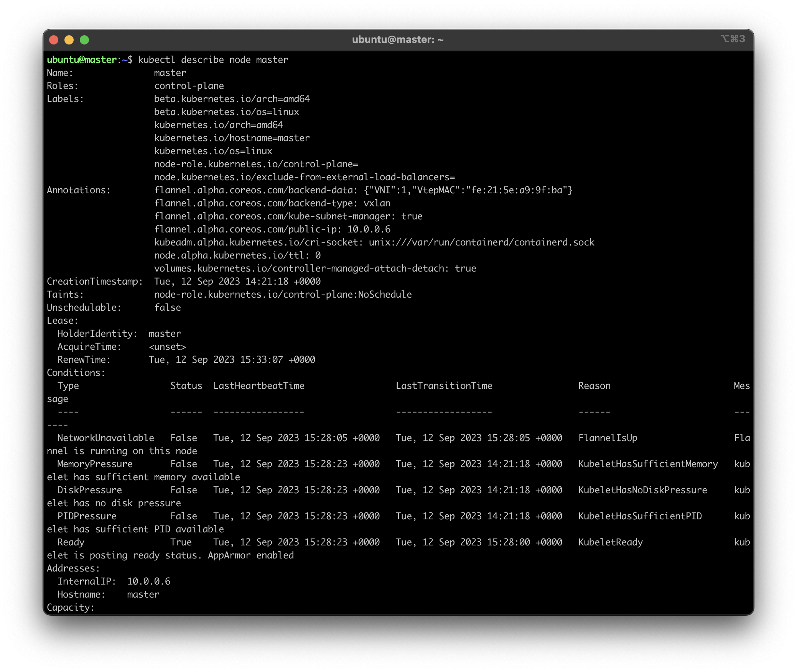

# Домашнее задание к занятию «Установка Kubernetes»

### Цель задания

Установить кластер K8s.

### Чеклист готовности к домашнему заданию

1. Развёрнутые ВМ с ОС Ubuntu 20.04-lts.


### Инструменты и дополнительные материалы, которые пригодятся для выполнения задания

1. [Инструкция по установке kubeadm](https://kubernetes.io/docs/setup/production-environment/tools/kubeadm/create-cluster-kubeadm/).
2. [Документация kubespray](https://kubespray.io/).

-----

### Задание 1. Установить кластер k8s с 1 master node

1. Подготовка работы кластера из 5 нод: 1 мастер и 4 рабочие ноды.
2. В качестве CRI — containerd.
3. Запуск etcd производить на мастере.
4. Способ установки выбрать самостоятельно.

## Ответ

#### Установка через kubeadm

С помощью terraform созданы виртуальные машины в Яндекс облаке:

```shell
external_ip_address_master_yandex_cloud = "158.160.114.242"
external_ip_address_node1_yandex_cloud = "158.160.123.79"
external_ip_address_node2_yandex_cloud = "158.160.117.76"
external_ip_address_node3_yandex_cloud = "158.160.116.148"
external_ip_address_node4_yandex_cloud = "158.160.98.28"
internal_ip_address_master_yandex_cloud = "10.0.0.6"
internal_ip_address_node1_yandex_cloud = "10.0.0.11"
internal_ip_address_node2_yandex_cloud = "10.0.0.8"
internal_ip_address_node3_yandex_cloud = "10.0.0.22"
internal_ip_address_node4_yandex_cloud = "10.0.0.36"
```

Подключаемся к master по ssh:

```shell
ssh ubuntu@158.160.114.242
```

Выполняем команды:

```shell
# Update the apt package index and install packages needed to use the Kubernetes apt repository
sudo apt-get update
sudo apt-get install -y apt-transport-https ca-certificates curl

sudo mkdir /etc/apt/keyrings
# Download the Google Cloud public signing key
curl -fsSL https://packages.cloud.google.com/apt/doc/apt-key.gpg | sudo gpg --dearmor -o /etc/apt/keyrings/kubernetes-archive-keyring.gpg

# Add the Kubernetes apt repository
echo "deb [signed-by=/etc/apt/keyrings/kubernetes-archive-keyring.gpg] https://apt.kubernetes.io/ kubernetes-xenial main" | sudo tee /etc/apt/sources.list.d/kubernetes.list

# Update apt package index, install kubelet, kubeadm and kubectl, and pin their version
sudo apt-get update
sudo apt-get install -y kubelet kubeadm kubectl containerd
sudo apt-mark hold kubelet kubeadm kubectl

# Включение forwarding
sudo -i
modprobe br_netfilter
echo "net.ipv4.ip_forward=1" >> /etc/sysctl.conf
echo "net.bridge.bridge-nf-call-iptables=1" >> /etc/sysctl.conf
echo "net.bridge.bridge-nf-call-arptables=1" >> /etc/sysctl.conf
echo "net.bridge.bridge-nf-call-ip6tables=1" >> /etc/sysctl.conf
sysctl -p /etc/sysctl.conf

logout
```

Инициализация мастер-ноды (Kubernetes control-plane):

```shell
# apiserver-advertise-address - internal node ip
# apiserver-cert-extra-sans - external node ip

sudo kubeadm init \
 --apiserver-advertise-address=10.0.0.6 \
 --pod-network-cidr 10.244.0.0/16 \
 --apiserver-cert-extra-sans=158.160.114.242
 --control-plane-endpoint=cluster_ip_address
```

Вывод результата:

```shell
Your Kubernetes control-plane has initialized successfully!

To start using your cluster, you need to run the following as a regular user:

  mkdir -p $HOME/.kube
  sudo cp -i /etc/kubernetes/admin.conf $HOME/.kube/config
  sudo chown $(id -u):$(id -g) $HOME/.kube/config

Alternatively, if you are the root user, you can run:

  export KUBECONFIG=/etc/kubernetes/admin.conf

You should now deploy a pod network to the cluster.
Run "kubectl apply -f [podnetwork].yaml" with one of the options listed at:
  https://kubernetes.io/docs/concepts/cluster-administration/addons/

Then you can join any number of worker nodes by running the following on each as root:

kubeadm join 10.0.0.6:6443 --token 2hzn3d.trlam65hy446kk8d \
	--discovery-token-ca-cert-hash sha256:d30077a271508eaba143be52ec2b79954307b542e46e936d4c010c158d5bba39
```

kubeadm join 158.160.114.242:6443 --token 2hzn3d.trlam65hy446kk8d \
	--discovery-token-ca-cert-hash sha256:d30077a271508eaba143be52ec2b79954307b542e46e936d4c010c158d5bba39

```shell
ubuntu@master:~$ kubectl get nodes
NAME     STATUS     ROLES           AGE    VERSION
master   NotReady   control-plane   3m8s   v1.28.1
```

Далее подготавливаем и присоединяем к кластеру kubernetes другие ноды:

```shell
ssh ubuntu@158.160.123.79  # node1
ssh ubuntu@158.160.117.76  # node2
ssh ubuntu@158.160.116.148 # node3
ssh ubuntu@158.160.98.28   # node4
```

```shell
# Update the apt package index and install packages needed to use the Kubernetes apt repository
sudo apt-get update
sudo apt-get install -y apt-transport-https ca-certificates curl

sudo mkdir /etc/apt/keyrings
# Download the Google Cloud public signing key
curl -fsSL https://packages.cloud.google.com/apt/doc/apt-key.gpg | sudo gpg --dearmor -o /etc/apt/keyrings/kubernetes-archive-keyring.gpg

# Add the Kubernetes apt repository
echo "deb [signed-by=/etc/apt/keyrings/kubernetes-archive-keyring.gpg] https://apt.kubernetes.io/ kubernetes-xenial main" | sudo tee /etc/apt/sources.list.d/kubernetes.list

# Update apt package index, install kubelet, kubeadm and kubectl, and pin their version
sudo apt-get update
sudo apt-get install -y kubelet kubeadm kubectl containerd
sudo apt-mark hold kubelet kubeadm kubectl

# Включение forwarding
sudo -i
modprobe br_netfilter
echo "net.ipv4.ip_forward=1" >> /etc/sysctl.conf
echo "net.bridge.bridge-nf-call-iptables=1" >> /etc/sysctl.conf
echo "net.bridge.bridge-nf-call-arptables=1" >> /etc/sysctl.conf
echo "net.bridge.bridge-nf-call-ip6tables=1" >> /etc/sysctl.conf
sysctl -p /etc/sysctl.conf

logout
```

Затем каждую присоединяем к кластеру:

```shell
sudo kubeadm join 10.0.0.6:6443 --token 2hzn3d.trlam65hy446kk8d \
	--discovery-token-ca-cert-hash sha256:d30077a271508eaba143be52ec2b79954307b542e46e936d4c010c158d5bba39
```

Вывод:

```shell
This node has joined the cluster:
* Certificate signing request was sent to apiserver and a response was received.
* The Kubelet was informed of the new secure connection details.

Run 'kubectl get nodes' on the control-plane to see this node join the cluster.
```

Установка компонента для создания адресов pod'ов:

```shell
kubectl apply -f https://raw.githubusercontent.com/coreos/flannel/master/Documentation/kube-flannel.yml
```

```shell
ubuntu@master:~$ kubectl get nodes
NAME     STATUS   ROLES           AGE   VERSION
master   Ready    control-plane   72m   v1.28.1
node1    Ready    <none>          31m   v1.28.1
node2    Ready    <none>          16m   v1.28.1
node3    Ready    <none>          15m   v1.28.1
node4    Ready    <none>          15m   v1.28.1
```



## Дополнительные задания (со звёздочкой)

**Настоятельно рекомендуем выполнять все задания под звёздочкой.** Их выполнение поможет глубже разобраться в материале.   
Задания под звёздочкой необязательные к выполнению и не повлияют на получение зачёта по этому домашнему заданию. 

------
### Задание 2*. Установить HA кластер

1. Установить кластер в режиме HA.
2. Использовать нечётное количество Master-node.
3. Для cluster ip использовать keepalived или другой способ.

### Правила приёма работы

1. Домашняя работа оформляется в своем Git-репозитории в файле README.md. Выполненное домашнее задание пришлите ссылкой на .md-файл в вашем репозитории.
2. Файл README.md должен содержать скриншоты вывода необходимых команд `kubectl get nodes`, а также скриншоты результатов.
3. Репозиторий должен содержать тексты манифестов или ссылки на них в файле README.md.
